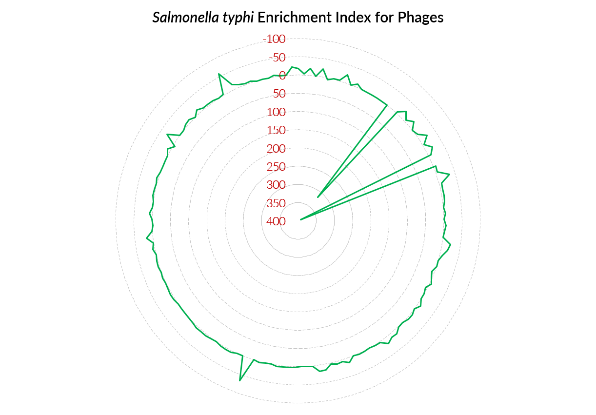

# Novel discovery of phages from Salmonella sequences: The case of typhoidal salmonellosis

## Process SAM files
Pysam requires the SAMs to be converted into BAMs for some steps. So run the following:
bash process_sams.sh $RESULTS_DIR

Where $RESULTS_DIR is the directory containing the results from the alignments i.e the SAM files created by magicblast
Count Hits
First we count the hits using the run_pipeline.py script. This script will also query the Entrez API to get the spot count of each run in order to normalise the data. This process can take a while.
This program outputs a CSV file for downstream analysis.
Alternatively you can skip normalisation at this step and normalise by the base count in the meta data run table information you downloaded earlier.
Example shown below:
python run_pipeline.py --bam_folder ../results/geuvadis_results --source geu --roi_start 25 --roi_end 45 --email halsteadjs@nih.gov --max_errors 3 --file_comment geu

## Merge with MetaData
Open the analysis/notebooks/merge_with_meta.ipynb notebook
Edit the options at the top of the notebook. df_meta = location of the run info table tsv df_data = location of the csv outputted by run_pipeline.py output_name = name of output csv normalise_with_mbases = True if you want to normalise with the mbases attribute

## Create Figures
There are a number of notebooks available to creating figures:
create_scatter_figure.ipynb
analysis_for_final_meeting.ipynb

## Preliminary Results

### Salmonella typhi Enrichment Index
The following radar chart shows the Salmonella typhi Enrichment Index for 153 differnet Phages. Astonishingly, only 2 phages had a high index in S. typhi, Vi06 and phiSG-JL2.

### What is unique about phages infecting S. typhi
To study why these 2 phages are highly successful in infecting S. typhi, not paratyphi, we performed further analysis using DELTA-BLAST. We found that Vi06 and phiSG-JL2 only among all phages share 3 homolgous proteins. The first is a protein that is homologus to the dGTPase inhibitor in E. coli. dGTPase is an important eznyme that plays a role in regulating the intracellular pool of dGTP and DNA repair mechanism. The second protein has a homology to a phage lambda Rz1-like protein. Rz1 is a component of the spanin complex that disrupts the host outer membrane and participates in cell lysis during virus exit. The third one was a hypothetical protein with yet unknown function.

Plays a role in increasing the intracellular pool of dGTP
